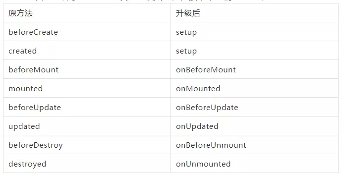

[TOC]

Vue (读音 /vjuː/，类似于 view) **是一套用于构建用户界面的渐进式框架**。与其它大型框架不同的是，**Vue 被设计为可以自底向上逐层应用**。**Vue 的核心库只关注视图层**，不仅易于上手，还便于与第三方库或既有项目整合。另一方面，当与现代化的工具链以及各种支持类库结合使用时，Vue 也完全能够为复杂的单页应用提供驱动。

## Vue 的主体内容

1. 依赖收集
2. 依赖更新
3. Virtual DOM ，dom 节点 生成虚拟 Vnode 节点
4. Compile， 模板编译
5. Diff、Patch， 节点比较更新
6. NextTick ，延迟执行回调
7. Render， 渲染机制
8. LifeCircle ，生命周期
9. Model ，双向绑定
10. Event ，事件机制

## Vue 的页面控制模式-MVVM

**MVC（Model-View-Controller）模式**将 Controller 改名为 Presenter，同时改变了通信方向。

分别是：

1. M（Model，**模型层** ，也就是数据 data()）；
   1. 模型层，主要**负责业务数据相关**；`data(){}`
2. V（View，**视图层**， 也就是模板）；
   1. 视图层，顾名思义，负责视图相关，**细分下来就是 html+css 层**；`template`
3. VM（ViewModel，V 与 M 连接的桥梁，也可以看作为**控制器**）。
   1. ViewModel 是 Vue.js 的核心，**它是一个 Vue 实例**。Vue 实例是**作用于某一个 HTML 元素上的**，这个元素可以是 HTML 的 body 元素，也可以是指定了 id 的某个元素。
   2. 负责监听 M 或者 V 的修改，是实现 MVVM 双向绑定的要点；`watch|method|computed|directive等`。

MVVM 支持**双向绑定**，意思就是当**M 层数据**进行修改时，**VM 层会监测到变化**，并且**通知 V 层进行相应的修改**，反之修改 V 层则会通知 M 层数据进行修改，以此也实现了视图与模型层的**相互解耦**；

### 双向数据绑定的实现，数据劫持

Vue 实现数据双向绑定主要是：采用数据劫持结合发布者-订阅者模式的方式，通过 Object 对象的 defineProperty 方法，重写 data 的 set 和 get 函数来实现的。可以查看 demo，[data-two-way-binding](./data-two-way-binding/Object.defineProperty实现数据双向绑定.html)。

```js
// 使用get和set
let obj = {
  // 设定默认值
  _data: {
    a: 123,
  },
};
Object.defineProperty(obj, 'a', {
  get() {
    // 当获取a时执行
    console.log('a被获取了');
    return obj._data.a;
  },
  set(value) {
    // 当修改a时执行
    obj._data.a = value;
    console.log('a的值被修改了');
  },
  enumerable: true, // 可被遍历得到
  writable: true, // 可被重新写入
  configurable: true, // 可被删除，且enumerable和value不能通过Object.defineProperty重新定义
});
```

#### Vue 双向数据绑定原理，依赖收集是在什么时候收集的

是在 **created 生命周期之前**，render 生成虚拟 dom 的时候，也就是 beforeCreated -> created 的时候。

#### 为什么 Vue 不需要 shouldComponentUpdate

1. 因为 Vue 的响应式系统已经**在初次渲染时收集了渲染依赖的数据项（用到的所有属性均被 getter setter 劫持）**，通过自动的方式就能够得到相当不错的性能。

## Vue 的优缺点

优点：

1. 低耦合。视图（View）可以独立于 Model 变化和修改，一个 ViewModel 可以绑定到不同的"View"上，当 View 变化的时候 Model 可以不变，当 Model 变化的时候 View 也可以不变。
2. 可重用性。你可以把一些**视图逻辑**放在一个 ViewModel 里面，让很多 view 重用这段视图逻辑。
3. 独立开发。**开发人员可以专注于业务逻辑和数据的开发（ViewModel）**，设计人员可以专注于页面设计，使用 Expression Blend 可以很容易设计界面并生成 xml 代码。
4. 可测试。界面素来是比较难于测试的，而现在测试可以针对 ViewModel 来写。

缺点：

1. 它不适于 seo 优化；
2. 而且封装的比较厉害；
3. 报错不明显；
4. 适合单人开发，适合中小型项目。

## 如何理解 Vue 的渐进式 Progressive

1. 与其它大型框架不同的是，Vue 被设计为可以**自底向上逐层应用**。
2. Vue 的核心库**只关注视图层**，不仅易于上手，还**便于与第三方库或既有项目整合**。
3. 可以认为是像`ejs`模版添加了一些内置的方法，**生成的强模版**，便于使用。
4. Vue 1.0 的官方定位是**视图管理**，Vue 2.0 的官方定位是**渐进式框架**。
   1. 渐进式代表的含义是：**主张最少**。

## Vue 核心思想：数据驱动、组件化

### 数据驱动，双向数据流

1. Vue.js 是一个提供了 `MVVM` 风格的**双向数据绑定**的 Javascript 库，专注于 View 层。
2. **省去操作 dom 的过程**，只需要改变数据，Vue 就会通过`Dircetives`来改变视图，数据驱动 DOM 变化，DOM 是数据的一种自然映射。
3. Vue 还会**对操作进行监听**，**当视图发生改变时，vue 监听到这些变化，从而改变数据**，这样就形成了数据的双向绑定。

### 组件化

1. 组件系统是 Vue 的另一个重要概念，因为它是一种**抽象**，允许我们使用小型、独立和通常**可复用**的组件构建大型应用。
2. 在 Vue 里，一个组件本质上是一个拥有**预定义选项的一个 Vue 实例**。
3. 在一个大型应用中，**有必要将整个应用程序划分为组件**，以使开发更易管理。
4. Vue 组件非常类似于**自定义元素（[Web Components](https://developer.mozilla.org/zh-CN/docs/Web/Web_Components)）**。

## Vue 的数据对象 data - Model

1. Vue 组件的数据源。
2. Vue 实例的数据对象。Vue 将会递归将 data 的 property 转换为 getter/setter，从而让 data 的 property 能够响应数据变化。
3. data 应该**只能是数据** - 不推荐观察拥有状态行为的对象。
4. data 需要是**纯粹的对象**，可能被用来创建多个实例。

[官方介绍](https://cn.vuejs.org/v2/api/#data)

### Vue 组件中 data 为什么必须是函数

data 必须声明为**返回一个初始数据对象的函数**，因为**组件可能被用来创建多个实例**。**如果 data 仍然是一个纯粹的对象，则所有的实例将共享引用同一个数据对象**！通过提供 data 函数，每次创建一个新实例后，我们能够调用 data 函数，从而返回初始数据的一个**全新副本数据对象**。

## 🍎Vue 的生命周期有哪些，都在什么时候触发，一般用来做什么

[官方文档](https://cn.vuejs.org/v2/api/#%E9%80%89%E9%A1%B9-%E7%94%9F%E5%91%BD%E5%91%A8%E6%9C%9F%E9%92%A9%E5%AD%90)
[生命周期示意图](https://cn.vuejs.org/v2/guide/instance.html#%E7%94%9F%E5%91%BD%E5%91%A8%E6%9C%9F%E5%9B%BE%E7%A4%BA)

总共分为 8 个阶段：

1. 创建前/后：初始化的时候调用
   1. **beforeCreate**
      1. vue 实例的挂载元素 el 和数据对象 data 都为 undefined，还未初始化。
      2. 组件还没有生成，数据观测都还未进行；
   2. **created**
      1. 在实例创建完成后被立即调用；
      2. vue 实例的数据对象 data 有了，el 还没有，**虚拟节点**。
      3. 实例生成，未挂载；
      4. 实例已完成以下的配置：**数据观测** (data observer)，属性和方法的运算，watch/event 事件回调。\$el 属性目前不可见。
2. 载入前/后：初始化的时候调用

   1. **beforeMount**
      1. vue 实例的\$el 和 data 都初始化了，**但还是挂载之前为虚拟的 dom 节点**，data.message 还未替换。
   2. **mounted**

      1. vue 实例**挂载完成**；
      2. data.message 成功渲染，**实际 dom 节点**，这个时候可操作 dom。
      3. 可以在这里进行数据请求；
      4. 修改 dom，修改 data 都可以进行了；
      5. mounted 不会承诺所有的子组件也都一起被挂载。如果你希望等到整个视图都渲染完毕，可以用 vm.\$nextTick 替换掉 mounted。

      ```js
      mounted: function () {
        this.$nextTick(function () {
          // Code that will run only after the
          // entire view has been rendered
        })
      }
      ```

3. 更新前/后：props 及 data 变更的时候调用
   1. **beforeUpdate**
      1. 这里适合在更新之前访问现有的 DOM，比如**手动移除已添加的事件监听器**。
   2. **updated**
      1. 你应该**避免在此期间更改状态**，如果要相应状态改变，通常最好使用计算属性或 watcher 取而代之。
      2. **updated 不会承诺所有的子组件也都一起被重绘**。如果你希望等到整个视图都重绘完毕，可以用 vm.\$nextTick 替换掉 updated。
4. 销毁前/后：组件被移出的时候调用，生命周期终结
   1. **beforeDestroy**
      1. 实例销毁之前调用。在这一步，**实例仍然完全可用**，实例只是被移出渲染树。
   2. **destroyed**
      1. 可以用来种植异步请求，避免出现错误；
      2. **Vue 实例销毁后调用**。调用后，Vue 实例指示的所有东西都会解绑定，**所有的事件监听器会被移除**，所有的子实例也会被销毁。
5. 对于 keep-alive 的组件的激活前/激活后状态
   1. **activated**，keep-alive 组件激活时调用；
   2. **deactivated**：keep-alive 组件停用时调用；
6. 错误捕获，**errorCaptured**

## Vue 区别与原生 js 开发，需要由原来的开发模式迁移过来的习惯

1. 事件在元素内绑定，在 methods 下定义；
2. 显示与隐藏通过 v-if|v-show 指令来控制；
3. 所有页面状态都由一份数据控制；
4. 关注实例的生命周期；
5. 页面跳转变为路由 vue-router；
6. 页面数据保存全局或对象中转为状态管理 vuex；
7. ajax 请求网络交互了。就学习尤大推荐的 axios 了；
   - vue-source 模块方式；插件性质；
   - axios 模块；Vue 官方推荐的网络通信库不再是 vue-resource 了，推荐使用 axios；
   - 自定义 fetch 方法；
8. 取得元素转为添加 ref 属性；
   1. ref 被用来给元素或子组件注册引用信息。
   2. 引用信息将会注册在父组件的 \$refs 对象上。如果在普通的 DOM 元素上使用，引用指向的就是 DOM 元素; 如果用在子组件上，引用就指向组件实例。

## Vue3.0 新版本的变化

[vue 3.0 proxy 替代 Object.defineProperty 监听](https://blog.csdn.net/gwdgwd123/article/details/89013282)

1. 更小
   1. 全局 API 和内置组件 / 功能支持 tree-shaking
   2. 驻的代码尺寸控制在 10kb gzipped 上下
2. 更快
   1. **基于 Proxy 的变动侦测，性能整体优于 getter / setter**，消除了当前 Vue 2 系列中基于 Object.defineProperty 所存在的一些局限：
      1. 对属性的添加、删除动作的监测；
      2. 对数组基于下标的修改、对于 .length 修改的监测；
      3. 对 Map、Set、WeakMap 和 WeakSet 的支持；
   2. Virtual DOM 重构
   3. 编译器架构重构，更多的编译时优化
3. 加强 API 设计一致性
4. 加强 TypeScript 支持
5. 提高自身可维护性
6. 代码采用 monorepo 结构，内部分层更清晰
   1. TypeScript 使得外部贡献者更有信心做改动
   2. 开放更多底层功能

### [Proxy 实例](https://developer.mozilla.org/zh-CN/docs/Web/JavaScript/Reference/Global_Objects/Proxy)

1. MDN 上的定义是：代理对象是用于定义基本操作的自定义行为（例如，属性查找，赋值，枚举，函数调用等）。
2. Proxy 是 ES6 里的新构造函数，**它的作用就是代理**，**简单理解为有一个对象，不想完全对外暴露出去，想做一层在原对象操作前的拦截、检查、代理，这时候你就要考虑 Proxy 了**。

这消除了以前存在的警告，使速度加倍，并节省了一半的内存开销。

```js
let obj = {
  a: 1,
};
let proxyObj = new Proxy(obj, {
  get: function (target, prop) {
    return prop in target ? target[prop] : 0;
  },
  set: function (target, prop, value) {
    target[prop] = 888;
  },
});

console.log(proxyObj.a); // 1
console.log(proxyObj.b); // 0

proxyObj.a = 666;
console.log(proxyObj.a); // 888
```

上述例子中，我们事先定义了一个对象 obj , 通过 Proxy 构造器生成了一个 proxyObj 对象，并对其的 set(写入) 和 get (读取) 行为重新做了修改。

#### Proxy 的优点

[Proxy 相比于 defineProperty 的优势](https://www.cnblogs.com/leftJS/p/11099478.html)。

Object.defineProperty 明显的缺点，总结起来大概是下面两个：

1. **无法监控到数组下标的变化**，导致直接通过数组的下标给数组设置值，不能实时响应。
2. Object.defineProperty**只能劫持对象的属性**，因此我们需要对每个对象的每个**属性进行遍历**。Vue 2.x 里，是通过 递归 + 遍历 data 对象来实现对数据的监控的，如果属性值也是对象那么需要深度遍历，显然如果能劫持一个完整的对象是才是更好的选择。

Proxy 相对于 Object.defineProperty 的优势：

1. 可以**劫持整个对象**，并**返回一个新对象**；
2. 有 13 种劫持操作；
3. 当您需要对数据进行**更多控制时**，代理可以派上用场。
4. 你可以根据**受控规则扩展或拒绝对原始数据的访问**，从而监视对象并确保正确行为。

Proxy 的问题：

1. Proxy 是 es6 提供的新特性，兼容性不好，最主要的是这个属性无法用 polyfill 来兼容；

### 生命周期的改变



1. beforeCreate -> setup
2. created -> setup
3. beforeMounte -> onBeforeMounted
4. mounted -> onMounted
5. beforeUpdate -> onBeforeUpdated
6. updated -> onUpdated
7. beforeDestroy -> onBeforeUnmounted
8. destroyed -> onUnmounted

### reactive

1. 作用：创建响应式对象，非包装对象，类似于在 2.0 的 data 中声明变量。
2. 它本身一种 Hooks 能力，用过 React Hook 的，**实际上就等同于 useState()**;

### ref

1. 作用：创建一个包装式对象，含有一个响应式属性 value
2. 它和 reactive 的差别，就是前者没有包装属性 value

注意区别，[页面元素的引用](https://cn.vuejs.org/v2/api/#ref)。
